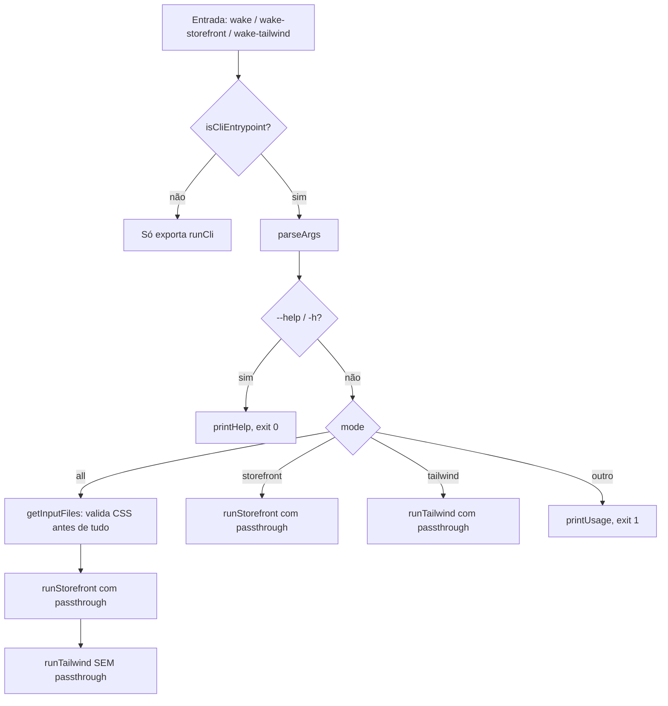

# wake-runner — Documentação técnica

Documento de handoff para o time que vai manter o projeto. O [README](../README.md) explica **como usar**; este documento explica **como funciona por dentro**, onde estão as armadilhas e como publicar novas versões.

---

## 1. Visão geral

`wake-runner` é uma CLI Node.js (pacote npm `wake-runner`) que automatiza o ambiente de desenvolvimento local de lojas **Wake Commerce**. Ela não implementa nada de storefront nem de CSS: apenas **descobre configurações no projeto Wake e dispara processos externos**:

| Ferramenta externa | O que o wake-runner faz |
|---|---|
| `fbits.storefront` (CLI oficial da Wake) | Lê o `access_token` de `Configs/settings.json` e executa `fbits.storefront --token <token>` |
| `tailwindcss` 3.4.18 | Encontra todos os `Assets/CSS/input*.css` e sobe um `tailwindcss --watch` para cada um |

Características:

- **Zero dependências** — só módulos nativos (`fs`, `path`, `child_process`).
- **Sem build** — o código-fonte publicado é o próprio código executado.
- **Um único arquivo de lógica**: [`bin/wake.js`](../bin/wake.js) (~270 linhas).
- **Sem testes automatizados** (ver [§8](#8-pontos-de-atenção-e-limitações-conhecidas)).

---

## 2. Estrutura do repositório

```text
wake_cli/
├── bin/
│   ├── wake.js              # toda a lógica da CLI
│   ├── wake-storefront.js   # alias: injeta o modo "storefront" no argv e carrega wake.js
│   └── wake-tailwind.js     # alias: injeta o modo "tailwind" no argv e carrega wake.js
├── docs/
│   └── DOCUMENTACAO-TECNICA.md
├── package.json             # define os 3 binários expostos
├── README.md                # documentação de uso (em inglês, vai para a página do npm)
├── CHANGELOG.md             # formato Keep a Changelog
└── LICENSE                  # MIT
```

### Binários (`package.json` → `bin`)

| Comando | Arquivo | Modo |
|---|---|---|
| `wake` | `bin/wake.js` | definido pelo 1º argumento posicional (`all` por padrão) |
| `wake-storefront` | `bin/wake-storefront.js` | `storefront` (fixo) |
| `wake-tailwind` | `bin/wake-tailwind.js` | `tailwind` (fixo) |

Os aliases existem porque nomes como `wake:storefront` não funcionam no Windows.

---

## 3. Fluxo de execução



### 3.1 Ponto de entrada (`isCliEntrypoint`, [wake.js:240](../bin/wake.js#L240))

Os aliases fazem `process.argv.splice(2, 0, '<modo>')` (inserem o modo como primeiro argumento) e `require('./wake')`. Como `wake.js` só executa a CLI quando é o "main module", a função `isCliEntrypoint()` aceita como main qualquer um dos três arquivos de `bin/`. Isso também permite que `wake.js` seja importado por outro script sem disparar nada (exporta `runCli(mode, minify, passthroughArgs)`).

### 3.2 Parser de argumentos (`parseArgs`, [wake.js:166](../bin/wake.js#L166))

Parser manual, sem biblioteca. Separa `process.argv` em três grupos:

1. **Flags próprias do wake-runner** — `--help`, `-h`, `--no-minify`. São consumidas e não repassadas.
2. **Passthrough** — qualquer outra flag (`--x` ou `-x`). Se o próximo argumento **não** começar com `-`, ele é tratado como valor da flag e vai junto (`--port 3000`) — exceto se for um nome de modo (`all`, `storefront`, `tailwind`) e o modo ainda não tiver sido definido; assim `wake --save storefront` funciona igual a `wake storefront --save`.
3. **Posicionais** — o primeiro vira o modo (`storefront`, `tailwind`). Os demais são ignorados.

Modo = 1º posicional, ou `'all'` se não houver nenhum.

### 3.3 Storefront (`runStorefront`, [wake.js:93](../bin/wake.js#L93))

1. `getToken()` lê `Configs/settings.json` (remove BOM UTF‑8 antes do `JSON.parse`, comum em arquivos salvos no Windows).
2. Valida que `access_token` existe e não é vazio.
3. Loga os 10 primeiros caracteres do token.
4. Executa `fbits.storefront --token <token> [passthrough...]`.

### 3.4 Tailwind (`runTailwind`, [wake.js:102](../bin/wake.js#L102))

1. `getInputFiles()` lista **apenas o nível raiz** de `Assets/CSS/` (sem recursão) e filtra arquivos que começam com `input` e terminam com `.css` (case-sensitive).
2. `getTailwindCommand()` decide qual Tailwind usar:
   - existe `node_modules/.bin/tailwindcss` (ou `.cmd` no Windows) no projeto → `npm exec tailwindcss -- ...`
   - senão → `tailwindcss` do PATH (CLI standalone ou instalação global).
3. Para cada arquivo, troca o prefixo `input` por `output` e sobe um processo:
   ```bash
   tailwindcss -i ./Assets/CSS/input_x.css -o ./Assets/CSS/output_x.css --watch [--minify] [passthrough...]
   ```
   `--minify` é o padrão; `--no-minify` remove.

### 3.5 Disparo de processos (`spawnCommand`, [wake.js:59](../bin/wake.js#L59))

```js
spawn(command, args, { stdio: 'inherit', cwd, shell: true });
```

- `stdio: 'inherit'` — a saída dos filhos aparece direto no terminal do usuário (os logs de vários watchers se misturam).
- `shell: true` — necessário no Windows para executar shims `.cmd` (`npm.cmd`, `tailwindcss.cmd`); desde o Node 18.20.2 / 20.12.2 o Node bloqueia `.cmd` sem shell (CVE-2024-27980). **Não remover sem testar no Windows.**
- O processo pai não guarda referência aos filhos, não escuta `exit`/`error` e não propaga código de saída. Ele fica vivo apenas porque os filhos herdam o stdio. `Ctrl+C` encerra todos porque o sinal vai para o grupo de processos do terminal.

---

## 4. Contrato com o projeto Wake

A CLI deve ser executada **na raiz do projeto Wake** (usa `process.cwd()`):

```text
projeto-wake/
├── Configs/settings.json   # { "access_token": "..." }
├── Assets/CSS/input*.css
└── node_modules/.bin/tailwindcss   # opcional; se existir, tem prioridade
```

### Erros (todos saem com código 1)

| Situação | Mensagem |
|---|---|
| `Configs/settings.json` não existe | `Error: Configs/settings.json not found...` |
| JSON inválido | `Error: invalid Configs/settings.json.` |
| `access_token` ausente/vazio | `Error: access_token not found in settings.json.` |
| `Assets/CSS/` não existe | `Error: Assets/CSS directory not found.` |
| Nenhum `input*.css` | `Error: no input*.css files found in Assets/CSS.` |
| Modo desconhecido (`wake foo`) | `Invalid usage. Run "wake --help"...` |

Falhas **dos processos filhos** (ex.: `fbits.storefront` não instalado) não são tratadas pelo wake-runner — aparecem como erro do próprio shell (`command not found` / `não é reconhecido como um comando`).

---

## 5. Ambiente de desenvolvimento

Pré-requisitos: Node.js (sem versão mínima declarada; testado no Node 24) e, para testar de ponta a ponta, `fbits.storefront` e `tailwindcss@3.4.18` instalados.

```bash
git clone https://github.com/SimksS/wake-runner.git
cd wake-runner
npm link            # ou: npm install -g .
```

Depois disso, `wake`, `wake-storefront` e `wake-tailwind` apontam para o código local — qualquer edição em `bin/` vale imediatamente. Para testar, rode os comandos dentro de um projeto Wake real (ou de uma pasta com a estrutura da [§4](#4-contrato-com-o-projeto-wake)).

Para desfazer: `npm unlink -g wake-runner`.

---

## 6. Publicação de versão

Não há CI; a publicação é manual.

1. Atualizar `CHANGELOG.md` (mover itens de `[Unreleased]` para a nova versão e atualizar os links de comparação no rodapé).
2. Gerar versão + tag:
   ```bash
   npm version patch   # ou minor / major — cria o commit "x.y.z" e a tag vx.y.z
   ```
3. Publicar e enviar:
   ```bash
   npm publish
   git push --follow-tags
   ```

Não existe campo `files` no `package.json`; o npm publica tudo que não está no `.gitignore` (hoje: `bin/`, `docs/`, README, CHANGELOG, LICENSE). Confira com `npm pack --dry-run` antes de publicar.

---

## 7. Como estender

- **Nova flag própria do wake-runner:** adicionar o nome em `WAKE_OWN_FLAGS` (e em `SHORT_FLAG_MAP`, se tiver forma curta) em `parseArgs`, devolver no objeto de retorno, tratar em `runCli` e documentar em `printHelp` + README + CHANGELOG.
- **Novo modo (ex.: `wake build`):** novo `case` em `runCli`; se quiser alias, criar `bin/wake-<modo>.js` copiando os aliases existentes, registrar em `package.json` → `bin`, incluir o arquivo na lista de `isCliEntrypoint()` (senão o alias não executa nada) **e** adicionar o nome em `MODES` dentro de `parseArgs`.
- **Novo processo paralelo:** usar `spawnCommand` para manter o mesmo comportamento de stdio/shell.

---

## 8. Pontos de atenção e limitações conhecidas

Comportamentos atuais que o novo time deve conhecer. (Três problemas da primeira versão deste documento já foram corrigidos — ver `[Unreleased]` no CHANGELOG: flag antes do modo, storefront órfão no modo `all` e `WAKE_MODE` vazando do ambiente.)

1. **Sem tratamento de falha dos filhos.** Se um watcher ou o storefront morrer, os demais continuam e o wake-runner não avisa nem retorna erro.
2. **Argumentos passam por um shell (`shell: true`).** O Node concatena os argumentos sem escapar; valores com espaços ou glob (`--content "./src/**/*.html"`) podem ser reinterpretados pelo shell (principalmente em Linux/macOS). Também por isso o token aparece na linha de comando do processo (visível em `ps`/Gerenciador de Tarefas). No Node 24 isso já gera o aviso `DeprecationWarning [DEP0190]` a cada execução — é provável que uma versão futura do Node passe a bloquear esse uso, e então `spawnCommand` terá que ser reescrito (ex.: `shell: false` + escolher `npm.cmd`/`tailwindcss.cmd` explicitamente no Windows).
3. **Tailwind local exige `npm` no PATH**, pois é invocado via `npm exec`.
4. **Varredura de CSS não é recursiva** e o filtro `input*.css` diferencia maiúsculas/minúsculas (`Input.css` é ignorado).
5. **Sem testes, sem lint, sem CI e sem `engines` no `package.json`.** Mudanças em `parseArgs` são as mais arriscadas; vale começar por um teste dele (exige exportá-lo).

### Estado das versões

- Publicadas no npm: **1.0.0**, **1.0.1** e **1.0.2** (`npm view wake-runner versions`).
- O `package.json` já está em **1.0.3**, mas essa versão **nunca foi publicada** — o commit `1.0.3` só fez o bump. As correções em `[Unreleased]` no CHANGELOG devem sair como 1.0.3: renomear a seção `[Unreleased]` para `[1.0.3]`, publicar e mover a tag `v1.0.3` para esse commit (`git tag -f v1.0.3` + `git push -f origin v1.0.3`). Como a versão já está em 1.0.3, use `npm publish` direto, sem `npm version`.
- As tags `v1.0.0` (commit `b25bec1`) e `v1.0.2` (commit `4e35141`), usadas nos links do CHANGELOG, foram recriadas a partir das datas de publicação no npm. Se ainda não estiverem no GitHub: `git push origin v1.0.0 v1.0.2`.

---

## 9. Checklist de transferência

Itens fora do código que precisam ser transferidos:

- [ ] Repositório GitHub `SimksS/wake-runner` → transferir para a organização do novo time (ou adicionar mantenedores). Os links em `package.json`, `README.md`, `CHANGELOG.md` e `printHelp()` apontam para essa URL e precisam ser atualizados se ela mudar.
- [ ] Pacote npm `wake-runner` → adicionar os novos mantenedores (`npm owner add <usuário> wake-runner`).
- [ ] Campo `author` em `package.json` (hoje `Kelvin Simons`) — atualizar se desejado.
- [ ] Referências externas: [instalação do fbits.storefront](https://wakecommerce.readme.io/docs/local#download) e [template padrão / Tailwind](https://wakecommerce.readme.io/docs/template-padrao#tailwindcss).
